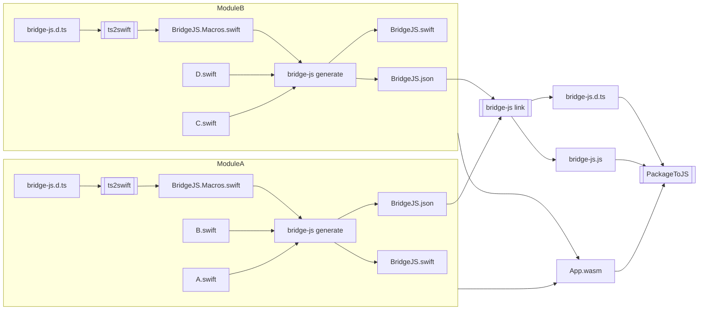

# BridgeJS

> [!IMPORTANT]
> This feature is still experimental, and the API may change frequently. Use at your own risk with `JAVASCRIPTKIT_EXPERIMENTAL_BRIDGEJS=1` environment variable.

> [!NOTE]
> This documentation is intended for JavaScriptKit developers, not JavaScriptKit users.

## Overview

BridgeJS provides easy interoperability between Swift and JavaScript/TypeScript. It enables:

1. **Importing TypeScript APIs into Swift**: Use TypeScript/JavaScript APIs directly from Swift code
2. **Exporting Swift APIs to JavaScript**: Make your Swift APIs available to JavaScript code

The workflow is:
1. `ts2swift` converts TypeScript definitions (`bridge-js.d.ts`) to macro-annotated Swift declarations (`BridgeJS.Macros.swift`)
2. `bridge-js generate` processes both Swift source files (for export) and macro-annotated Swift files (for import) to generate:
   - `BridgeJS.swift` (Swift glue code)
   - `JavaScript/BridgeJS.json` (a unified skeleton for linking)
3. `bridge-js link` combines module skeletons (`JavaScript/BridgeJS.json`) to produce JavaScript glue code (`bridge-js.js` and `bridge-js.d.ts`)

## Architecture Diagram



## Type Mapping

### Primitive Type Conversions

TBD

| Swift Type    | JS Type    | Wasm Core Type |
|:--------------|:-----------|:---------------|
| `Int`         | `number`   | `i32`          |
| `UInt`        | `number`   | `i32`          |
| `Int8`        | `number`   | `i32`          |
| `UInt8`       | `number`   | `i32`          |
| `Int16`       | `number`   | `i32`          |
| `UInt16`      | `number`   | `i32`          |
| `Int32`       | `number`   | `i32`          |
| `UInt32`      | `number`   | `i32`          |
| `Int64`       | `bigint`   | `i64`          |
| `UInt64`      | `bigint`   | `i64`          |
| `Float`       | `number`   | `f32`          |
| `Double`      | `number`   | `f64`          |
| `Bool`        | `boolean`  | `i32`          |
| `Void`        | `void`     | -              |
| `String`      | `string`   | `i32`          |

## Type Modeling

TypeScript uses [structural subtyping](https://www.typescriptlang.org/docs/handbook/type-compatibility.html), but Swift doesn't directly offer it. We can't map every TypeScript type to Swift, so we made several give-ups and heuristics.

### `interface`

We intentionally don't simulate TS's `interface` with Swift's `protocol` even though they are quite similar for the following reasons:

* Adding a protocol conformance for each `interface` implementation adds binary size cost in debug build because it's not easy to DCE.
* No straightforward way to represent the use of `interface` type on the return type position of TS function. Which concrete type it should it be?
* For Embedded Swift, we should avoid use of existential type as much as possible.

Instead of simulating the subtyping-rule with Swift's `protocol`, we represent each `interface` with Swift's struct.
In this way, we lose implicit type coercion but it makes things simpler and clear.

TBD: Consider providing type-conversion methods to simulate subtyping rule like `func asIface()`

### Anonymous type literals

Swift offers a few non-nominal types, tuple and function types, but they are not enough to provide access to the underlying storage lazily. So we gave up importing them in typed way.

## ABI

This section describes the ABI contract used between JavaScript and Swift.
The ABI will not be stable, and not meant to be interposed by other tools.

### Parameter Passing

Parameter passing follows Wasm calling conventions, with custom handling for complex types like strings and objects.

TBD

### Return Values

TBD

## Future Work

- [ ] Struct on parameter or return type
- [ ] Throws functions
- [ ] Async functions
- [ ] Cast between TS interface
- [ ] Closure support
- [ ] Simplify constructor pattern
    * https://github.com/ocsigen/ts2ocaml/blob/main/docs/js_of_ocaml.md#feature-immediate-constructor
    ```typescript
    interface Foo = {
      someMethod(value: number): void;
    }

    interface FooConstructor {
      new(name: string) : Foo;

      anotherMethod(): number;
    }

    declare var Foo: FooConstructor;
    ```
- [ ] Use `externref` once it's widely available
- [ ] Test SwiftObject roundtrip
