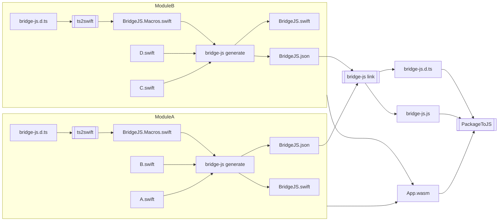

# BridgeJS

> [!IMPORTANT]
> This feature is still experimental, and the API may change frequently. Use at your own risk.

> [!NOTE]
> This documentation is intended for JavaScriptKit developers, not JavaScriptKit users. For user documentation, see [Exporting Swift to JavaScript](https://swiftpackageindex.com/swiftwasm/JavaScriptKit/documentation/javascriptkit/exporting-swift-to-javascript) and [Importing TypeScript into Swift](https://swiftpackageindex.com/swiftwasm/JavaScriptKit/documentation/javascriptkit/importing-typescript-into-swift).

## Overview

BridgeJS provides easy interoperability between Swift and JavaScript/TypeScript. It enables:

1. **Importing TypeScript APIs into Swift**: Use TypeScript/JavaScript APIs directly from Swift code
2. **Exporting Swift APIs to JavaScript**: Make your Swift APIs available to JavaScript code

The workflow is:

1. `ts2swift` converts TypeScript definitions (`bridge-js.d.ts`) to macro-annotated Swift declarations (`BridgeJS.Macros.swift`)
2. `bridge-js generate` processes both Swift source files (for export) and macro-annotated Swift files (for import) to generate:
   - `BridgeJS.swift` (Swift glue code)
   - `JavaScript/BridgeJS.json` (a unified skeleton for linking)
3. `bridge-js link` combines module skeletons (`JavaScript/BridgeJS.json`) to produce JavaScript glue code (`bridge-js.js` and `bridge-js.d.ts`)

## Architecture Diagram



## Type Mapping

### Primitive Types

| Swift Type    | TypeScript Type | Wasm Core Type |
|:--------------|:----------------|:---------------|
| `Int`         | `number`        | `i32`          |
| `UInt`        | `number`        | `i32`          |
| `Int8`        | `number`        | `i32`          |
| `UInt8`       | `number`        | `i32`          |
| `Int16`       | `number`        | `i32`          |
| `UInt16`      | `number`        | `i32`          |
| `Int32`       | `number`        | `i32`          |
| `UInt32`      | `number`        | `i32`          |
| `Int64`       | `bigint`        | `i64`          |
| `UInt64`      | `bigint`        | `i64`          |
| `Float`       | `number`        | `f32`          |
| `Double`      | `number`        | `f64`          |
| `Bool`        | `boolean`       | `i32`          |
| `Void`        | `void`          | -              |

### Complex Types

| Swift Type | TypeScript Type | Semantics | Status |
|:-----------|:----------------|:----------|:-------|
| `String` | `string` | Copy | ✅ |
| `@JS class` | `interface` + constructor | Reference (pointer) | ✅ |
| `@JS struct` | `interface` | Copy (fields via stacks) | ✅ |
| `@JS enum` (case) | const object + tag type | Copy (integer) | ✅ |
| `@JS enum` (raw value) | const object + tag type | Copy (raw value) | ✅ |
| `@JS enum` (associated) | discriminated union | Copy (fields via stacks) | ✅ |
| `@JS protocol` | `interface` | Reference (wrapper) | ✅ |
| `Optional<T>` | `T \| null` | Depends on T | ✅ |
| `(T) -> U` | `(arg: T) => U` | Reference (boxed) | ✅ |
| `JSObject` | `any` / `object` | Reference | ✅ |
| `Array<T>` | `T[]` | Copy | ✅ |
| `Array<Array<T>>` | `T[][]` | Copy | ✅ |
| `Dictionary<K, V>` | `Record<K, V>` | - | [#495](https://github.com/swiftwasm/JavaScriptKit/issues/495) |
| `Set<T>` | `Set<T>` | - | [#397](https://github.com/swiftwasm/JavaScriptKit/issues/397) |
| `Foundation.URL` | `string` | - | [#496](https://github.com/swiftwasm/JavaScriptKit/issues/496) |
| Generics | - | - | [#398](https://github.com/swiftwasm/JavaScriptKit/issues/398) |

### Import-specific (TypeScript -> Swift)

| TypeScript Type | Swift Type | Status |
|:----------------|:-----------|:-------|
| `T \| null` | `Optional<T>` | [#475](https://github.com/swiftwasm/JavaScriptKit/issues/475) |
| `T \| undefined` | `Optional<T>` | [#475](https://github.com/swiftwasm/JavaScriptKit/issues/475) |
| `enum` | `@JS enum` | [#489](https://github.com/swiftwasm/JavaScriptKit/issues/489) |

## Type Modeling

TypeScript uses [structural subtyping](https://www.typescriptlang.org/docs/handbook/type-compatibility.html), but Swift doesn't directly offer it. We can't map every TypeScript type to Swift, so we made several give-ups and heuristics.

### `interface`

We intentionally don't simulate TS's `interface` with Swift's `protocol` even though they are quite similar for the following reasons:

* Adding a protocol conformance for each `interface` implementation adds binary size cost in debug build because it's not easy to DCE.
* No straightforward way to represent the use of `interface` type on the return type position of TS function. Which concrete type it should it be?
* For Embedded Swift, we should avoid use of existential type as much as possible.

Instead of simulating the subtyping-rule with Swift's `protocol`, we represent each `interface` with Swift's struct.
In this way, we lose implicit type coercion but it makes things simpler and clear.

TBD: Consider providing type-conversion methods to simulate subtyping rule like `func asIface()`

### Anonymous type literals

Swift offers a few non-nominal types, tuple and function types, but they are not enough to provide access to the underlying storage lazily. So we gave up importing them in typed way.

## ABI

This section describes the ABI contract used between JavaScript and Swift.
The ABI will not be stable, and not meant to be interposed by other tools.

### Parameter Passing

Parameter passing follows Wasm calling conventions, with custom handling for complex types:

- **Primitives**: Passed directly as Wasm arguments (`i32`, `i64`, `f32`, `f64`)
- **Strings**: UTF-8 bytes stored in `swift.memory`, ID + length passed as Wasm arguments
- **Swift Classes**: Raw Swift heap pointer passed as `i32`
- **JSObjects**: Object stored in `swift.memory.heap`, object ID passed as `i32`
- **Structs/Arrays**: Fields/elements pushed to type-specific stacks, Swift pops in reverse order
- **Closures**: Boxed and retained in memory, handle passed as `i32`

### Return Values

Return values use direct Wasm returns for primitives, and imported intrinsic functions for complex types:

- **Primitives**: Returned directly via Wasm return value
- **Strings**: Swift writes UTF-8 bytes to shared memory, JS decodes
- **Swift Classes**: Pointer returned directly, JS wraps in `SwiftHeapObject` with `FinalizationRegistry`
- **Structs/Arrays**: Swift pushes fields/elements to type-specific stacks, JS reconstructs

### Memory Management

- **Swift Classes**: Live on Swift heap. JS holds pointer wrapped in `SwiftHeapObject`. `FinalizationRegistry` calls `deinit` on GC. Optional `release()` for deterministic cleanup.
- **JSObjects**: Live in `swift.memory.heap` (JS side). Swift holds ID wrapped in `JSObject`. Reference counted via `retain`/`release`.
- **Structs/Arrays/Enums**: Copy semantics - data serialized across boundary. No cleanup needed.
- **Closures**: Boxed on source side, released when GC'd on either side.

For detailed semantics, see the [How It Works sections](https://swiftpackageindex.com/swiftwasm/JavaScriptKit/documentation/javascriptkit/exporting-swift-class#How-It-Works) in the user documentation.

## Testing

- **Full BridgeJS tests** (Swift + TS2Swift Vitest): `swift test --package-path ./Plugins/BridgeJS`
- **TS2Swift only** (fast iteration on `.d.ts` -> Swift): `npm -C Sources/TS2Swift/JavaScript test`
- **Regenerate snapshot artifacts**: `UPDATE_SNAPSHOTS=1 swift test --package-path ./Plugins/BridgeJS`

## Debug utilities

`BridgeJSToolInternal` exposes pipeline stages for debugging:

- `emit-skeleton` - Parse Swift files (or `-` for stdin) and print the BridgeJS skeleton as JSON.
- `emit-swift-thunks` — Read skeleton JSON (from a file or `-` for stdin) and print the generated Swift glue (export and import thunks).
- `emit-js` / `emit-dts` - Read skeleton JSON files (or `-` for stdin) and print the .js/.d.ts

Use these to inspect parser output and generated code without running the full generate/link pipeline.

```console
$ cat <<EOS | ./Plugins/BridgeJS/.build/debug/BridgeJSToolInternal emit-skeleton - | ./Plugins/BridgeJS/.build/debug/BridgeJSToolInternal emit-dts -
@JSFunction func foo() throws(JSException) -> Int
@JS class Bar {
  @JS init() {}
  @JS func baz() {}
}
EOS
```

## Future Work

- [ ] Cast between TS interface
- [ ] Simplify constructor pattern ([reference](https://github.com/ocsigen/ts2ocaml/blob/main/docs/js_of_ocaml.md#feature-immediate-constructor))
    ```typescript
    interface Foo = {
      someMethod(value: number): void;
    }

    interface FooConstructor {
      new(name: string) : Foo;

      anotherMethod(): number;
    }

    declare var Foo: FooConstructor;
    ```
- [ ] Use `externref` once it's widely available
- [ ] Test SwiftObject roundtrip
- [ ] Import TS `enum` as Swift enum ([#489](https://github.com/swiftwasm/JavaScriptKit/issues/489))
- [ ] Support `T | null` and `T | undefined` imports ([#475](https://github.com/swiftwasm/JavaScriptKit/issues/475))
- [ ] Support `@JS var` for global scope imports ([#466](https://github.com/swiftwasm/JavaScriptKit/issues/466))
- [ ] Support `export { thing } from 'pkg'` form ([#437](https://github.com/swiftwasm/JavaScriptKit/issues/437))
- [ ] Support imported TS type usage on exported interface ([#497](https://github.com/swiftwasm/JavaScriptKit/issues/497))
