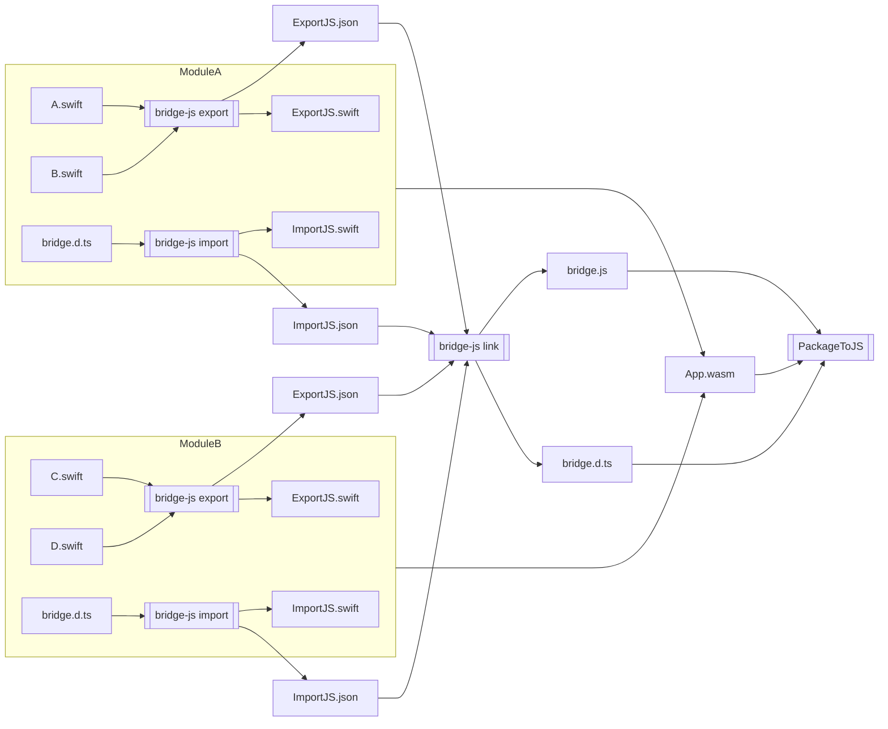

# BridgeJS

## Overview

```mermaid
graph LR
    E1 --> G3[ExportJS.json]
    subgraph ModuleA
        A.swift --> E1[[bridge-js export]]
        B.swift --> E1
        E1 --> G1[ExportJS.swift]
        B1[bridge.d.ts]-->I1[[bridge-js import]]
        I1 --> G2[ImportJS.swift]
    end
    I1 --> G4[ImportJS.json]

    E2 --> G7[ExportJS.json]
    subgraph ModuleB
        C.swift --> E2[[bridge-js export]]
        D.swift --> E2
        E2 --> G5[ExportJS.swift]
        B2[bridge.d.ts]-->I2[[bridge-js import]]
        I2 --> G6[ImportJS.swift]
    end
    I2 --> G8[ImportJS.json]

    G3 --> L1[[bridge-js link]]
    G4 --> L1
    G7 --> L1
    G8 --> L1

    L1 --> F1[bridge.js]
    L1 --> F2[bridge.d.ts]
    ModuleA -----> App[App.wasm]
    ModuleB -----> App

    App --> PKG[[PackageToJS]]
    F1 --> PKG
    F2 --> PKG
```

## ABI

This section describes the ABI contract used between JavaScript and Swift.
The ABI will not be stable, and not meant to be interposed by other tools.

### Primitive Type Conversions

| Swift Type    | JS Type    | Wasm Core Type |
|:--------------|:-----------|:---------------|
| `Int`         | `number`   | `i32`          |
| `UInt`        | `number`   | `i32`          |
| `Int8`        | `number`   | `i32`          |
| `UInt8`       | `number`   | `i32`          |
| `Int16`       | `number`   | `i32`          |
| `UInt16`      | `number`   | `i32`          |
| `Int32`       | `number`   | `i32`          |
| `UInt32`      | `number`   | `i32`          |
| `Int64`       | `bigint`   | `i64`          |
| `UInt64`      | `bigint`   | `i64`          |
| `Float`       | `number`   | `f32`          |
| `Double`      | `number`   | `f64`          |
| `Bool`        | `boolean`  | `i32`          |
| `Void`        | `void`     | -              |

### Calling Convention: JS -> Swift

#### Parameter Passing

TBD

#### Returning of Values

For types having 1-1 lossless conversion to Wasm Core Type, just use them as the return type.
For those JS return values that cannot be directly represented as Wasm Core Types (e.g. String, Array), the return type of the function would be `void`, and the result value will be written in a temporary storage that should be visible from JS side and the caller JS glue code should take the value from there.

## TODO

- [ ] Struct on parameter or return type
- [ ] Throws functions
- [ ] Async functions

## Future Works

- Use `externref` once it's widely available
